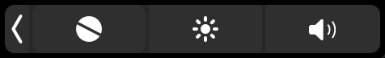

	

# Focus Timer

Simple [pomodoro](https://en.wikipedia.org/wiki/Pomodoro_Technique) timer for the mac touch bar    

## How to use

- **Tap** to start
- **Double tap** to drop
- **Hold** to close
- **Swipe** to rewind

[Download](https://github.com/aloshev/FocusTimer/releases/latest/download/FocusTimer.zip)